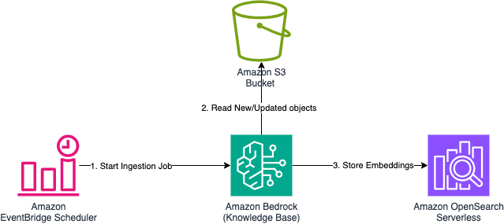
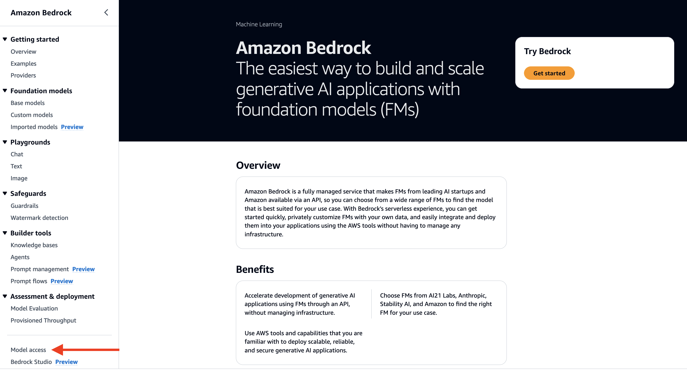
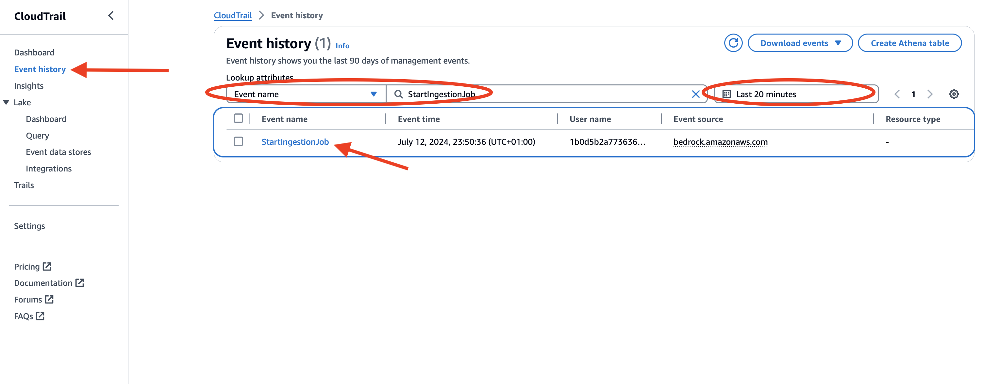
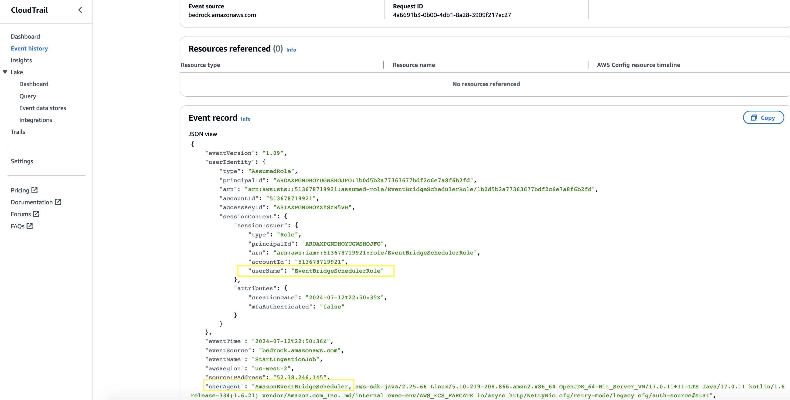

# EventBridge to Amazon Bedrock to Amazon OpenSearch Serverless


This pattern demonstrates an approach to automatically sync datasource associated with Knowledge Bases for Amazon Bedrock. Knowledge bases for Amazon Bedrock help you take advantage of Retrieval Augmented Generation (RAG), a popular technique that involves drawing information from a data store to augment the responses generated by Large Language Models (LLMs). When you set up a knowledge base with your data sources, your application can query the knowledge base to return information to answer the query either with direct quotations from sources or with natural responses generated from the query results.

After you create your knowledge base, you ingest your data source/sources into your knowledge base so that they're indexed and are able to be queried. Additionally each time you add, modify, or remove files from your data source, you must sync the data source so that it is re-indexed to the knowledge base. Syncing is incremental, so Amazon Bedrock only processes added, modified, or deleted documents since the last sync.

At the time of writing, Knowledge Bases for Amazon Bedrock doesn't have a feature to automatically periodically sync the datasource associated with a Knowledge Base. So customers who need to refresh their datasources periodically to ensure their knowledge base is up-to-date have to rely on bespoke solution to achieve it. This pattern shows one way of achieving it, using Amazon EventBridge Scheduler 

EventBridge Scheduler simplifies scheduling tasks by providing a centralized, serverless service that reliably executes schedules and invokes targets across various AWS services. In this particular pattern, we configure an EventBridge schedule that runs periodically (using a schedule expression). As part of the EventBridge schedule creation, we configure a target. A target is an API operation that EventBridge Scheduler invokes on your behalf whenever the schedule runs. In our case the target API would be the `StartIngestion` API operation on the Amazon Bedrock Agents service.

Learn more about this pattern at Serverless Land Patterns: https://serverlessland.com/patterns/eventbridge-bedrock-s3-aoss


Important: this application uses various AWS services and there are costs associated with these services after the Free Tier usage - please see the [AWS Pricing page](https://aws.amazon.com/pricing/) for details. You are responsible for any AWS costs incurred. No warranty is implied in this example.

## Requirements

* [Create an AWS account](https://portal.aws.amazon.com/gp/aws/developer/registration/index.html) if you do not already have one and log in. The IAM user that you use must have sufficient permissions to make necessary AWS service calls and manage AWS resources.
* [AWS CLI](https://docs.aws.amazon.com/cli/latest/userguide/install-cliv2.html) installed and configured
* [Git Installed](https://git-scm.com/book/en/v2/Getting-Started-Installing-Git)
* [Node and NPM](https://nodejs.org/en/download/) installed
* [AWS Cloud Development Kit](https://docs.aws.amazon.com/cdk/latest/guide/cli.html) (AWS CDK) installed


## Enable Model Access on Amazon Bedrock
Knowledge bases for Amazon Bedrock use a foundation model to embed your data sources in a vector store. Before creating a knowledge base and selecting an embeddings model for the Knowledge Base, You must request access to the model. If you try to use the model (with the API or console) before you have requested access to it, you receive an error message. For more information, see [Model access](https://docs.aws.amazon.com/bedrock/latest/userguide/model-access.html).

1. In the AWS console, select the region from which you want to access Amazon Bedrock. 

    

1. Find **Amazon Bedrock** by searching in the AWS console.

    

1. Expand the side menu.

    

1. From the side menu, select **Model access**.

    

1. Depending on your view, Select the **Enable specific models** button or the **Modify Model Access** button

   
    

6. Use the checkboxes to select the models you wish to enable. Review the applicable EULAs as needed. Click **Save changes** to activate the models in your account. For this pattern, by default, we would only need Titan Text Embeddings V2  /  model id: amazon.titan-embed-text-v2:0.

## Deployment Instructions

1. Create a new directory, navigate to that directory in a terminal and clone the GitHub repository:
    ``` 
    git clone https://github.com/aws-samples/serverless-patterns
    ```
1. Change directory to the pattern directory:
    ```
    cd eventbridge-bedrock-s3-aoss
    ```
1. Create virtual environment for Python
    ```
    python3 -m venv .venv
    ```
    For a Windows platform, activate the virtualenv like this:
    ```
    .venv\Scripts\activate.bat
    ```
    For a OSX / Linux platform, activate the virtualenv like this:
    ```
    source .venv/bin/activate
    ```
1. Install the Python required dependencies:
    ```
    pip install -r requirements.txt
    ```
1. Install dependencies for Lambda
    
    Change directory to <code>functions/layers</code> and run <code>pip install</code>
    ```
    cd functions/layers
    pip install --target python -r requirements.txt
    ```

1. Run the command below to bootstrap your account. CDK needs it to deploy
    ```
    cdk bootstrap
    ```
1. see the list of the IDs of the stacks in the AWS CDK application:
    ```
    cdk list
    ```

1. Review the CloudFormation template CDK generates for a given stack using the following AWS CDK CLI command:

    ```
    cdk synth <stack_id>
    ```

1. From the command line, use AWS CDK to deploy the AWS resources.
    ```
    cdk deploy --all
    ```
## How it works
CDK will create a Knowledge Base for Bedrock with a S3 Bucket as data source and an OpenSearch Serverless collection to store vector data. The stack also include an EventBridge scheduler that is configured to run every 5 mins and invoke the `StartIngestionJob` API on Amazon Bedrock Agents service. Amazon Bedrock supports a monitoring system to help you understand the execution of any data ingestion jobs. The Stack would create the neccessary CloudWatch log groups and CloudWatch delivery. You can gain visibility into the ingestion of your knowledge base resources with this logging system. Additionally, Amazon Bedrock is integrated with AWS CloudTrail, a service that provides a record of actions taken by a user, role, or an AWS service in Amazon Bedrock. CloudTrail captures all API calls for Amazon Bedrock as events.


## Testing

### Verify Event Scheduler is ENABLED
The EventScheduler should be enabled by default when the stack creation is complete. You can verify this by running the below command. The expected output of the command is the text `ENABLED`. This means that the scheduler is enabled and is ready to run at the next schedule time. 
```
aws scheduler get-schedule --name BedrockKBDataSourceSyncSchedule --group BedrockKBSyncScheduleGroup --query 'State' --output text
```
### View CloudTrail log for StartIngestionJob
1. In the CloudTrail console, click on Event history. Event history provides a viewable, searchable, downloadable, and immutable record of the past 90 days of management events. 


1. Filter using the Event Name as StartIngestionJob as well as by date and time (for example, Last 20 minutes)


1. In the Event Record, verify that the `sessionContext.sessionIssuer.userName` mentions `EventBridgeSchedulerRole` which is the role that was created by the CDK stack, and assigned to the EventBridge Schedule. Also the `userAgent` indicates `AmazonEventBridgeScheduler` as the agent through which the request was made. 

### Tail the CloudWatch Logs to look for Sync Events
The CDK creates resources to enable logging for an Amazon Bedrock knowledge base using the CloudWatch contructs.
See [Knowledge bases logging](https://docs.aws.amazon.com/bedrock/latest/userguide/knowledge-bases-logging.html) for more information.
The following command tails the CloudWatch log to view KnowledgeBase events as they are logged.

> [!NOTE]  
> Substitute the knowledge_base_id found in the CDK Output section of the `cdk deploy` command output of the `BedrockKnowledgebaseStack`


```
aws logs tail --follow --since 2m BedrockKnowledgeBase-<knowledge_base_id>
```

### View Ingestion Job timestamp and status
Once you've verified that the EventBridge scheduler has invoked the StartIngestionJob, you can use the following command to check the status of ingestion job. The command outputs the most recently started ingestion job.

> [!NOTE]  
> Substitute the knowledge_base_id and data_source_id found in the CDK Output section of the `cdk deploy` command output of the `BedrockKnowledgebaseStack`

```
aws bedrock-agent list-ingestion-jobs --knowledge-base-id <knowledge_base_id> --data-source-id <data_source_id> --query 'reverse(sort_by(ingestionJobSummaries,&startedAt))[:1].{startedAt:startedAt, updatedAt:updatedAt,ingestionJobId:ingestionJobId,status:status}'
```
### Use the knowledge base to Retrieve and Generate


## Cleanup
 
1. Run below script in the `eventbridge-bedrock-s3-aoss` directory to delete AWS resources created by this sample stack.
    ```bash
    cdk destroy --all
    ```

## Extra Resources
* [Bedrock Api Reference](https://docs.aws.amazon.com/bedrock/latest/APIReference/welcome.html)
* [Sync to ingest your data sources into the knowledge base](https://docs.aws.amazon.com/bedrock/latest/userguide/knowledge-base-ingest.html)
* [What is Amazon EventBridge Scheduler?](https://docs.aws.amazon.com/scheduler/latest/UserGuide/what-is-scheduler.html)
* [Using universal targets with EventBridge Scheduler](https://docs.aws.amazon.com/scheduler/latest/UserGuide/managing-targets-universal.html)

----
Copyright 2024 Amazon.com, Inc. or its affiliates. All Rights Reserved.

SPDX-License-Identifier: MIT-0