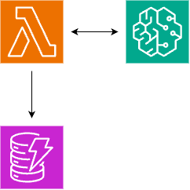

# Amazon Bedrock to Amazon DynamoDB

This pattern demonstrates how to use AWS Lambda to process queries using Amazon Bedrock's Claude 3 Haiku model and store the conversation results in Amazon DynamoDB.

Learn more about this pattern at Serverless Land Patterns: [Serverless Land](https://serverlessland.com/patterns/)

Important: this application uses various AWS services and there are costs associated with these services after the Free Tier usage - please see the [AWS Pricing page](https://aws.amazon.com/pricing/) for details. You are responsible for any AWS costs incurred. No warranty is implied in this example.

## Requirements

* [Create an AWS account](https://portal.aws.amazon.com/gp/aws/developer/registration/index.html) if you do not already have one and log in. The IAM user that you use must have sufficient permissions to make necessary AWS service calls and manage AWS resources.
* [AWS CLI](https://docs.aws.amazon.com/cli/latest/userguide/install-cliv2.html) installed and configured
* [Git Installed](https://git-scm.com/book/en/v2/Getting-Started-Installing-Git)
* [AWS Serverless Application Model](https://docs.aws.amazon.com/serverless-application-model/latest/developerguide/serverless-sam-cli-install.html) (AWS SAM) installed

## Deployment Instructions

1. Create a new directory, navigate to that directory in a terminal and clone the GitHub repository:
    ``` 
    git clone https://github.com/aws-samples/serverless-patterns/lambda-bedrock-dynamodb-sam
    
    ```
1. Change directory to the pattern directory:
    ```
    cd bedrock-to-dynamodb
    ```
1. From the command line, use AWS SAM to deploy the AWS resources for the pattern as specified in the template.yml file:
    ```
    sam deploy --guided
    ```
1. During the prompts:
    * Enter a stack name
    * Enter the desired AWS Region
    * Enter a name for your DynamoDB table
    * Allow SAM CLI to create IAM roles with the required permissions.

    Once you have run `sam deploy --guided` mode once and saved arguments to a configuration file (samconfig.toml), you can use `sam deploy` in future to use these defaults.

1. Note the outputs from the SAM deployment process. These contain the resource names and/or ARNs which are used for testing.

## How it works

This pattern creates a Lambda function that uses Amazon Bedrock's Claude 3 Haiku model to process queries. The function then stores both the query and the response in a DynamoDB table. The Lambda function is triggered by an event containing a 'query' key, processes the query using Bedrock, and stores the result in DynamoDB.

## Testing

1. Invoke the Lambda function with a test event containing a query:
    ```bash
    aws lambda invoke --function-name lambda-processor --cli-binary-format raw-in-base64-out --payload '{"query": "What is the capital of France?"}' output.txt
    ```
2. Check the DynamoDB table to see the stored query and response:
    ```bash
    aws dynamodb scan --table-name YOUR_TABLE_NAME
    ```

Replace `YOUR_TABLE_NAME` with the actual name of your DynamoDB table.

## Cleanup
 
1. Delete the stack
    ```bash
sam delete
    ```
1. Confirm the stack has been deleted
    ```bash
    aws cloudformation list-stacks --query "StackSummaries[?contains(StackName,'STACK_NAME')].StackStatus"
    ```
----
Copyright 2024 Amazon.com, Inc. or its affiliates. All Rights Reserved.

SPDX-License-Identifier: MIT-0# Bedrock and DynamoDB Integration

This project demonstrates an AWS SAM (Serverless Application Model) application that integrates Amazon Bedrock with Amazon DynamoDB. It creates a Lambda function that processes queries using Bedrock's Claude 3 Haiku model and stores the results in a DynamoDB table.

## Architecture

- AWS Lambda function
- Amazon Bedrock (Claude 3 Haiku model)
- Amazon DynamoDB



## Prerequisites

- AWS CLI configured with appropriate permissions
- AWS SAM CLI installed
- Python 3.12
- This pattern uses Anthropic Claude foundation model provided by Amazon Bedrock. It is required to request access to the model before starting using the pattern. Please refer to the link below for an instruction: [Model access](https://docs.aws.amazon.com/bedrock/latest/userguide/model-access.html). This example uses Claude 3 Haiku model.

## Setup

1. Clone this repository
2. Navigate to the project directory

## Deployment

To deploy this application:

1. Build the SAM application:
   ```
   sam build
   ```

2. Deploy the SAM application:
   ```
   sam deploy --guided
   ```

   Follow the prompts to set up your deployment. You'll need to provide a name for your DynamoDB table.

## Usage

The Lambda function can be invoked with an event containing a 'query' key. For example:

```json
{
  "query": "What is the capital of France?"
}
```

The function will process this query using Bedrock's Claude 3 Haiku model and store both the query and response in the DynamoDB table.

## Resources Created

- **DynamoDB Table**: Stores the queries and responses.
- **Lambda Function**: Processes queries using Bedrock and stores results in DynamoDB.

## Configuration

The main configuration parameters are set in the SAM template:

- `tableName`: The name of the DynamoDB table (passed as a parameter during deployment)
- Lambda function timeout: 180 seconds
- Lambda function memory: 128 MB

## IAM Permissions

The Lambda function is granted the following permissions:

- `dynamodb:PutItem` on the created DynamoDB table
- `bedrock:InvokeModel` and `bedrock:Converse` for the Claude 3 Haiku model

## Environment Variables

The Lambda function uses the following environment variable:

- `table_name`: Set to the name of the created DynamoDB table

## Limitations

- The function is configured to use the Claude 3 Haiku model. Adjust the `model_id` in the Lambda code if you want to use a different model.
- The maximum token output is set to 2000. Adjust the `max_tokens` variable in the Lambda code if needed.
- The test has only been carried out in  `us-east-1`

## Contributing

Contributions are welcome! Please feel free to submit a Pull Request.

## License

This project is licensed under the MIT License - see the LICENSE file for details.
